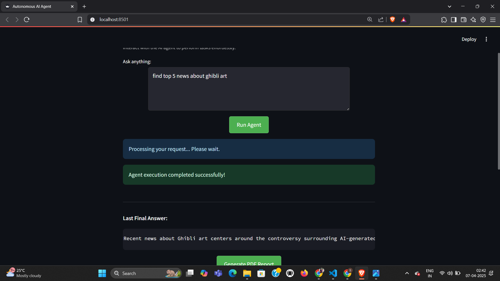
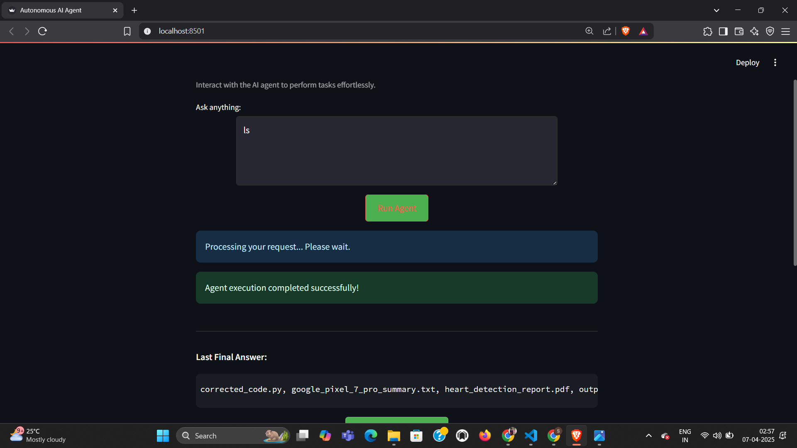

# Autonomous AI Agent


This project provides a web-based user interface built with Streamlit to interact with an autonomous AI agent. It allows users to input instructions, run the agent, view the results, and manage files generated by the agent within a designated output directory. It also includes functionality to generate a basic PDF report from the agent's output.

The Streamlit application serves as a frontend to a potentially complex AI agent system capable of interacting with various environments like web browsers, terminals, and the file system.

## Features

*   **Agent Interaction:** Input natural language instructions for the AI agent.
*   **Run Agent:** Execute the underlying AI agent logic (imported from `agent.planner`).
*   **Result Display:** Shows the final output/answer provided by the agent.
*   **Verbose Logging:** Optionally displays the detailed thought process and actions taken by the agent (if captured).
*   **Output File Browser:**
    *   Lists files generated by the agent in the `outputs/` directory.
    *   Displays file names and sizes.
    *   Sorts files by modification time (newest first).
    *   Provides a **Refresh** button to update the file list.
*   **File Management:**
    *   **Download:** Download selected output files.
    *   **Delete:** Delete selected output files with a confirmation step.
*   **Content Preview:**
    *   Displays the content of selected text-based files (.txt, .md, .py, .json, .csv, etc.).
    *   Provides syntax highlighting for common code/markup languages.
    *   Handles large files by showing a truncated preview and a warning.
    *   Indicates when preview is unavailable for non-text or binary files.
*   **PDF Report Generation:**
    *   Generates a PDF document containing the last agent output.
    *   Includes placeholder logic to embed charts (using Matplotlib).
    *   Allows downloading the generated PDF report.
*   **Environment Variable Handling:** Uses a `.env` file for sensitive information like API keys.
*   **API Key Check:** Detects the likely required API key based on the agent implementation and warns the user if it's missing.
*   **Custom Styling:** Applies a custom dark theme for a better user experience.
*   **Error Handling:** Provides user-friendly messages for common errors (missing API key, agent errors, file operation errors).
*   **State Management:** Uses Streamlit's `session_state` to remember the last agent result, logs, and selected file across interactions and reruns.
*   **Caching:**
    *   Uses `st.cache_resource` to initialize the agent executor once.
    *   Uses `st.cache_data` to cache the file list, with manual invalidation via the Refresh button.

## Key Components (Underlying Agent System)

The effectiveness of this Streamlit UI depends on the capabilities of the backend AI agent system it interfaces with. The core components of that *agent system* should include:

1.  **Instruction Understanding:** Ability to parse natural language instructions from the user into actionable tasks or sub-tasks.
2.  **Task Planning:** Logic to break down complex instructions into a sequence of steps appropriate for the available tools and execution environments.
3.  **Execution Environment Interaction:** Implementations for interacting with different environments:
    *   Browser automation tools (e.g., Selenium, Playwright)
    *   Terminal command execution
    *   File system operations (read, write, list, etc.)
4.  **Integration Layer / Orchestrator:** The central logic (often the agent executor itself) that manages the flow between planning, tool selection, execution, and error handling across different environments.

## Approach & Architecture

1.  **Streamlit Frontend (`app.py`):**
    *   Acts as the main entry point and user interface layer.
    *   Handles user input (instructions, button clicks, file selections).
    *   Manages the application's state (`st.session_state`).
    *   Displays agent results, file lists, and previews.
    *   Orchestrates calls to the agent logic and file system operations.

2.  **Agent Logic (`agent/planner.py` - *External*)**:
    *   This module contains the core AI agent implementation (using frameworks like LangChain, AutoGen, etc.), incorporating the "Key Components" mentioned above.
    *   The `initialize_agent` function is imported and used to create the agent executor instance.
    *   `app.py` invokes the agent using `agent_executor.invoke({"input": instruction})`.
    *   The agent interacts with its tools (browser, terminal, file system) and LLMs to process the user's instruction.

3.  **Output Directory (`outputs/`)**:
    *   A dedicated directory where the agent saves generated files.
    *   `app.py` scans this directory for the file browser.

4.  **Environment Configuration (`.env`)**:
    *   Stores necessary API keys used by the agent's LLM.
    *   `python-dotenv` loads these variables.

5.  **State Management (`st.session_state`)**:
    *   Maintains context (last result, selected file, confirmation flags) between UI interactions.

6.  **File Handling (`pathlib`)**:
    *   Uses `pathlib` for interacting with the `outputs/` directory.

7.  **PDF Generation (`fpdf2`, `matplotlib`)**:
    *   Libraries used within `app.py` to generate reports from agent output.

## Verification Stages (Agent System Capabilities)

The underlying AI agent system should ideally be verifiable across different operational stages:


### Stage 1: Individual Environment Execution (Target: 40% Capability)
Demonstrate the AI system working effectively within *each* environment separately:

*   **Browser Execution:**
    *   AI interprets instructions related to web tasks (e.g., "find reviews for product X").
    *   Navigates to appropriate websites.
    *   Extracts relevant information accurately.

      
    
*   **Terminal Execution:**
    *   AI runs appropriate terminal commands based on instructions (e.g., "list files in directory Y", "run script Z").
    *   Processes data using scripts or standard command-line tools.
    *   Handles command errors gracefully (e.g., command not found, permission denied).

        
        
*   **File System Execution:**
    *   AI creates, reads, modifies, and deletes files/directories as instructed.
    *   Organizes data into appropriate formats (e.g., saving scraped data to CSV).
    *   Manages file locations correctly.
 
### Stage 2: Dual Environment Integration (Target: 30% Capability)
Demonstrate the AI connecting *two* environments to accomplish a task:

*   **Browser + Terminal:** e.g., Scrape data from a website, then use terminal commands/scripts to process or analyze that data.
*   **Terminal + File System:** e.g., Process data using terminal commands, then generate a report file summarizing the results.
*   **Browser + File System:** e.g., Scrape data from a website and save it directly into a structured file (CSV, JSON).

### Stage 3: Full System Integration (Target: 30% Capability)
Demonstrate a complete workflow utilizing *all three* environments sequentially:

*   **Browser → Terminal → File System:** e.g., Find information online (Browser), process/analyze it using scripts (Terminal), and save the final report/output (File System).
*   Workflow includes robust error handling across environment transitions.
*   Ideally implements at least one advanced feature (e.g., complex data analysis, conditional logic based on findings).


## Setup & Installation

1.  **Prerequisites:**
    *   Python 3.8+
    *   Git (optional, for cloning)

2.  **Clone the Repository:**
    ```bash
    git clone <your-repo-url>
    cd <your-repo-directory>
    ```

3.  **Create a Virtual Environment (Recommended):**
    ```bash
    python -m venv venv
    # On Windows
    .\venv\Scripts\activate
    # On macOS/Linux
    source venv/bin/activate
    ```

4.  **Install Dependencies:**
    Make sure you have a `requirements.txt` file listing all necessary packages (streamlit, python-dotenv, fpdf2, matplotlib, langchain, langchain-openai/google-genai/huggingface_hub, etc.).
    ```bash
    pip install -r requirements.txt
    ```

5.  **Create and Configure `.env` File:**
    Create a file named `.env` in the project root directory. Add the necessary API key(s) based on the LLM used in your `agent/planner.py`:
    ```dotenv
    # Example for OpenAI
    OPENAI_API_KEY="sk-..."

    # Example for Google Gemini
    # GOOGLE_API_KEY="AIza..."

    # Example for Hugging Face Hub
    # HUGGINGFACEHUB_API_TOKEN="hf_..."
    ```
    *The application attempts to detect which key is needed.*

6.  **Ensure Agent Logic Exists:**
    Make sure the `agent/planner.py` file exists and correctly implements the `initialize_agent` function compatible with the expected agent framework (e.g., LangChain).

## Usage

1.  Activate your virtual environment (if you created one).
2.  Navigate to the project's root directory in your terminal.
3.  Run the Streamlit application:
    ```bash
    streamlit run app.py
    ```
4.  The application should open in your web browser automatically.
5.  Enter instructions in the text area and click "Run Agent".
6.  Browse, preview, download, or delete files generated in the `outputs/` directory using the file browser section.
7.  Generate a PDF report from the last agent output if needed.

## Code Structure

```plaintext
.
├── agent/                  # Directory containing the core AI agent logic
│   └── planner.py        # Script responsible for initializing and defining the agent
│
├── outputs/              # Default directory where the agent saves generated files
│   └── .gitkeep          # Placeholder file to ensure the directory exists in Git
│
├── .env                  # File storing environment variables (API keys) - **Not committed to Git**
│
├── app.py                # The main Streamlit application script:
│                         #   - Defines the User Interface (UI)
│                         #   - Handles user input and interactions
│                         #   - Initializes and invokes the agent from agent/planner.py
│                         #   - Manages the display of results and logs
│                         #   - Implements the file browser, preview, download, and delete features
│                         #   - Includes PDF generation logic
│
├── requirements.txt      # Lists all Python package dependencies for the project
│
└── README.md             # Project documentation explaining setup, usage, and approach

